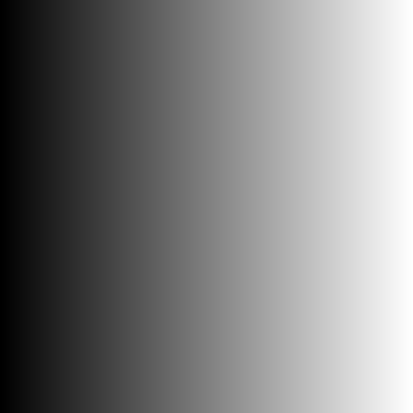
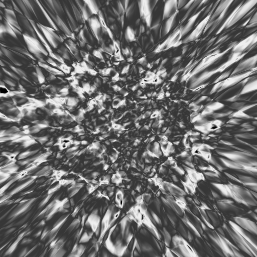
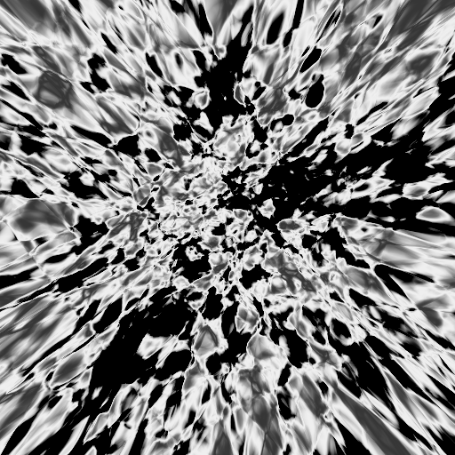
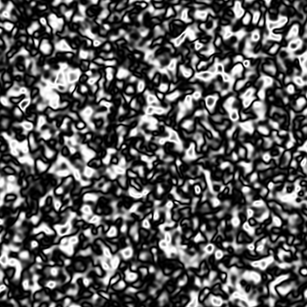
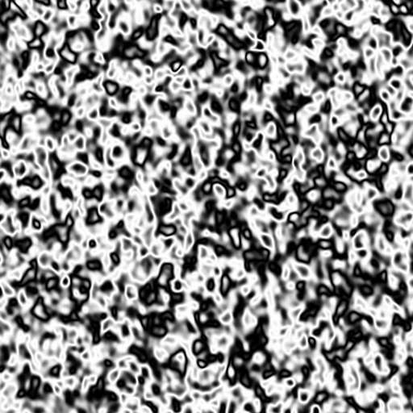

# LogisticMapDNN

I wanted to explore how to make DNNs (even) more non-linear and somehow visualize their non-linearness. Since DNN non-linearness comes from specific, non-linear activation function, I though trying out different activation functions might be a good start. To get a sense of how nonlinear resulting
DNN is, I'll visualize its outputs in a specific way: 

The network is going to take in 2 scalars (X and Y coordinates) and output a single scalar value. 
We're going to visualize the output values across the input space (in range [-5, 5]), so each pixel 
in the image represents DNN output for one point in input (x-y) space. The less smooth output 
values are across input-value space, less linear network should be (roughly, this is not rigorous 
math).

For example, if our "network" would be just picking the x-value and propagating it as output, the output image would be:



## Model

```
class Model(torch.nn.Module):
    def __init__(self):
        super(Model, self).__init__()
        self.affine1 = torch.nn.Linear(2, 64)
        self.affine2 = torch.nn.Linear(64, 64)
        self.affine3 = torch.nn.Linear(64, 64)
        self.affine4 = torch.nn.Linear(64, 1)

    def forward(self, x):
        x = activation_fn(self.affine1(x))
        x = activation_fn(self.affine2(x))
        x = activation_fn(self.affine3(x))
        x = activation_fn(self.affine4(x))
        return x
```

Very simple 4 layer MLP, activation function is something we'll play with.

## ReLU


Not very non-linear

Parameters to use if you want to replicate:
```
Logistic Map Iterations: 0
Cosine: False
```

## LogisticMap




Parameters to use if you want to replicate:
```
Logistic Map Iterations: 2
Logistic Map R: 3.7584300000000015
Cosine: False
```

Much better in terms of non-linearity. Also looks cool.

## Cosine

Since LogisticMap activation seems to be more visualy "dense" in near zero, I wanted to try
something that is more regular across input space. Instead of clamping input values to
logistic map into (0, 1) range I instead passed them through cosine. It turns out that once
you do that, logistic map doesn't make that much difference in how the output looks. I
kept just cosine as activation function, which results in these nice pictures:




Parameters to use if you want to replicate:
```
Logistic Map Iterations: 0
Cosine: True
Frequency: 7.9
```

Interestingly, these look quite similar to http://iquilezles.org/www/articles/warp/warp.htm and it
seems they are also similar mathematically. Inigo's images are generated roughly by:

```
y = fbm(x + fbm(x + fbm(x)))
```

whereas DNN with cosine activation is

```
y = cos(W1 * cos(W2 * cos(W3 * cos(x))))
```

`fbm` is just a sum of multiple cosines, and instead of `+ x`, we're performing more random linear transformation.